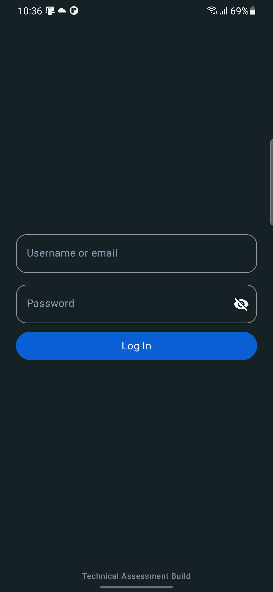
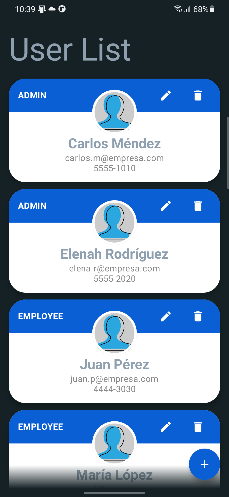
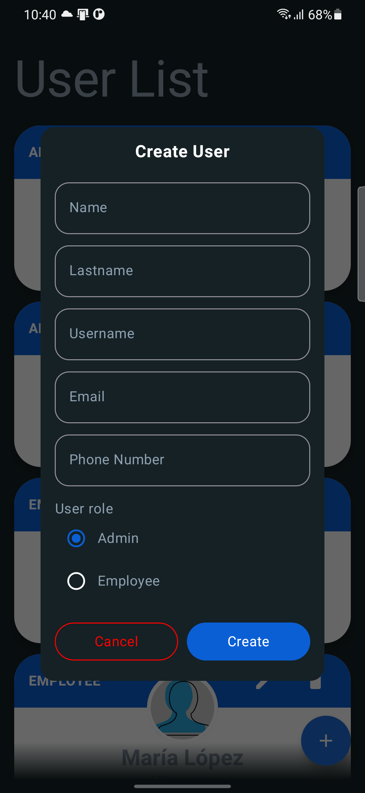
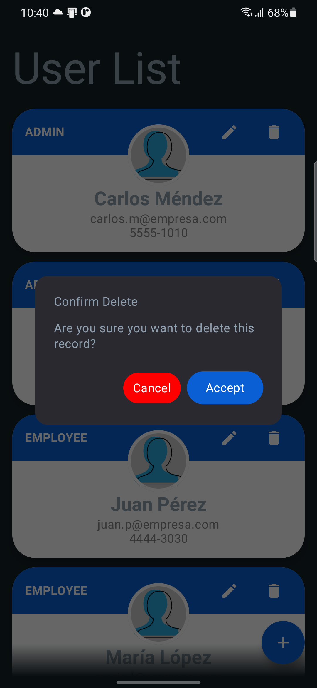
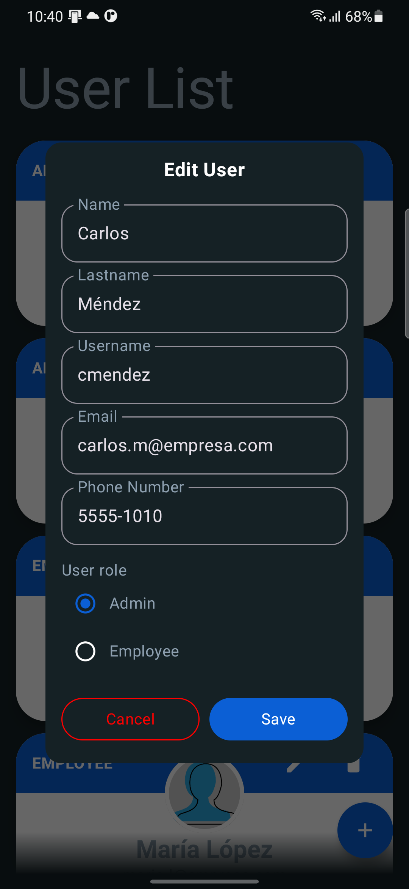
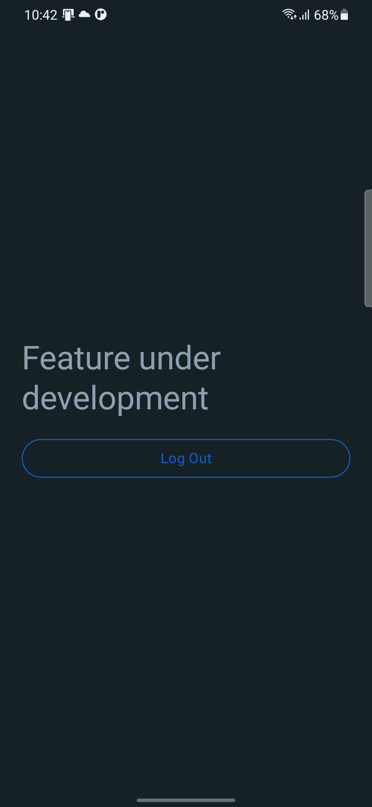

# Resolución Prueba Técnica - Intecap 2026

Repositorio que contiene la resolución integral de la prueba técnica para el área de desarrollo, abarcando bases de datos relacionales (SQL), modelado y desarrollo de aplicaciones móviles nativas.

---

## 📂 Estructura del Proyecto por Series

Este repositorio está organizado de la siguiente manera para facilitar su revisión:

### 1. Serie I: SQL – DDL (Estructura)
* **Archivo:** `CodigoDB.sql`
* **Contenido:** Código para la creación de la base de datos, definición de tablas, llaves primarias y foráneas.

### 2. Serie II: SQL – DML (Manipulación de Datos)
* **Archivo:** `QueriesSQL.sql`
* **Contenido:** * Carga de roles y puestos.
    * Gestión de empleados y usuarios.
    * Creación de **Vistas** de base de datos.
    * Lógica de actualización y eliminación de registros.

### 3. Serie III: Diseño de Base de Datos
* **Archivo:** `Modelo_Relacional_Normalizado.png`
* **Descripción:** Diagrama Entidad-Relación normalizado que resuelve la problemática planteada, asegurando la integridad de los datos.

  

### 4. Serie IV: Desarrollo de Aplicación Android
* **Carpeta:** `/AndroidApp`
* **Tecnologías:** 
    * **Lenguaje:** Kotlin
    * **UI:** Jetpack Compose (Material 3)
    * **Arquitectura:** MVVM (Model-View-ViewModel)
    * **Inyección de Dependencias:** Dagger Hilt
    * **Red / API:** Retrofit + Firebase Realtime Database
    * **Manejo de Estados:** StateFlow & SharedFlow

---

## Capturas de Pantalla

Aquí se muestra el funcionamiento de la aplicación desarrollada en la Serie IV:

| Pantalla de Login | Dashboard / Lista de Usuarios |
|:---:|:---:|
|  |  |
| *Acceso seguro al sistema* | *Visualización dinámica de registros* |

| Creación | Confirmación de Borrado |
|:---:|:---:|
|  |  |
| *Formulario de gestión de usuarios* | *Control de acciones destructivas* |

| Edición | Feature under development |
|:---:|:---:|
|  |  |
| *Formulario de gestión de usuarios* |  |

---

## 🛠️ Requisitos para Ejecución

1.  **SQL:** Los scripts pueden ejecutarse en cualquier motor compatible con SQL Standard (MySQL/PostgreSQL/SQL Server).
2.  **Android:** * Android Studio Jellyfish | 2023.3.1 o superior.
    * JDK 17.
    * Conexión a Internet (para sincronización con Firebase).

---

## 👤 Autor
* **Nombre:** Armando Santos
* **Fecha:** Febrero 2026